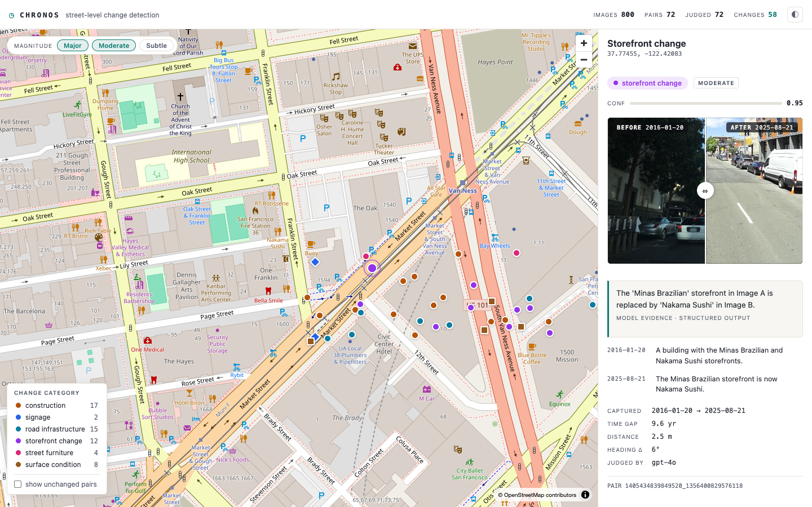
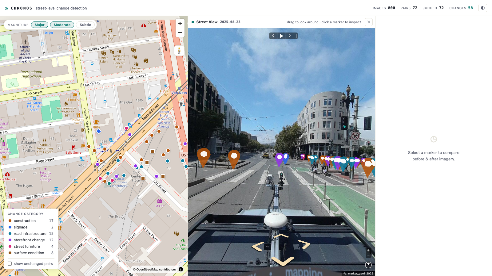

# Chronos

Detect durable physical changes to city streets from crowdsourced street-level
imagery. Chronos pairs Mapillary photos of the same spot taken years apart,
judges each pair with a vision LLM, and puts the results on a map with a
before/after slider.



Big changes (construction, demolition) are already tracked in permit databases.
Small ones — a repaved crosswalk, a removed bollard, a spreading pavement
crack — exist in no dataset at all. Chronos's story is its **detection floor**:
the same judge that flags a finished building flags a `subtle` surface change,
and the map filters down to the layer no city has records of.

## How it works

```
ingest ──► Mapillary images ──► pairing ──► candidate pairs
                                               │
inspect ─► vision LLM (strict JSON) ────► judgments
                                               │
serve  ──► FastAPI + MapLibre map ──► before/after explorer
```

1. **Ingest** pulls street-level images for a bounding box from the Mapillary
   Graph API (auto-tiling dense areas, caching every response), then finds
   pairs: two photos within 15 m and 30° of heading, captured ≥ 2 years apart,
   from different capture sequences. Greedy 1:1 matching keeps one
   best-aligned pair per location.
2. **Inspect** sends each pair to the OpenAI vision API with a strict JSON
   schema. The model must describe both images *before* judging, then reports
   `category`, `magnitude` (major / moderate / subtle), calibrated
   `confidence`, and one sentence of `evidence`. Verdicts under 0.40
   confidence are coerced to `no_change` in code.
3. **Serve** renders judged pairs on a MapLibre map — markers colored by
   category, magnitude filter chips, and a slider that wipes between the two
   captures. Drag the **pegman** onto the map for a Street View mode: drop it
   anywhere to walk through the latest Mapillary imagery, with the detected
   changes floating as markers in the scene.

Everything is idempotent: images, pairs, judgments, and raw API responses live
in SQLite, and no pair is ever re-fetched or re-judged.

## Setup

Requires Python 3.12 and two API keys:
[Mapillary](https://www.mapillary.com/dashboard/developers) (free) and
[OpenAI](https://platform.openai.com/api-keys).

```bash
python -m venv .venv && source .venv/bin/activate
pip install -r requirements.txt
cp .env.example .env   # then paste your two keys into .env
```

## Usage

```bash
# 1. Fetch imagery for a bbox and build candidate pairs (free)
python -m chronos ingest --bbox -122.43,37.77,-122.40,37.79 --limit 500

# subtle-change preset: tighter alignment for surface-level detail
python -m chronos ingest --bbox ... --max-dist 8 --max-heading 15

# 2. Judge pairs with the vision model (costs ~$0.01/pair; --dry-run to preview)
python -m chronos inspect --dry-run
python -m chronos inspect --limit 25

# 3. Explore the results
python -m chronos serve            # http://127.0.0.1:8000
```

The ingest summary prints how many pairs a bbox produced *before* you spend
anything on judging. `inspect --image-size 2048` sends higher-resolution
thumbnails for surface-focused runs.

## UI

- Markers colored by change category (palette validated for color-vision
  deficiency in both themes; the two color-adjacent categories also get
  distinct marker shapes)
- Magnitude filter — loads with Major + Moderate active, Subtle as an opt-in
  chip
- Click a marker: before/after wipe slider, capture dates, the model's
  description of each image, its evidence sentence, and pair geometry
- Light and dark themes (follows the system, toggle in the header)
- **Street View mode** — drag the pegman onto the map to drop into navigable
  Mapillary imagery (via [mapillary-js](https://github.com/mapillary/mapillary-js)),
  with detected changes as clickable 3D markers and a "you are here" indicator
  synced back to the map
- Deep links: `/?pair=<pair_id>` preselects a marker, `/?sv=<lat>,<lon>` opens
  Street View at a point, `/?theme=dark` forces a theme



> **Note on the Mapillary token:** Street View runs the viewer in the browser,
> so the server exposes the token via `/api/config`. Mapillary access tokens are
> client-usable by design (like a Maps API key); for a public deployment, use a
> token scoped to read-only.

## Project layout

```
chronos/
├── chronos/
│   ├── __main__.py     # CLI: ingest | inspect | serve
│   ├── pairing.py      # pure pairing logic (unit-tested, no I/O)
│   ├── mapillary.py    # Graph API client: tiling, paging, cache, thumbnails
│   ├── inspector.py    # vision judge: strict schema, retries, backstops
│   ├── server.py       # FastAPI: JSON API + static UI
│   ├── db.py           # SQLite schema and helpers
│   └── static/         # vanilla JS + MapLibre GL + mapillary-js (no build step)
├── prompts/inspector.md  # the judging prompt
├── tests/                # pairing + inspector tests
└── data/                 # gitignored: SQLite DB + cached thumbnails
```

6 dependencies, no build step, runs entirely locally.
